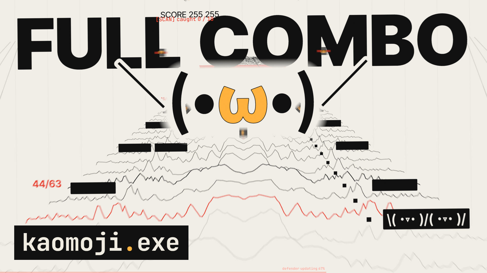

# kaomoji.exe

**A 100.8-second motion-design film made entirely of code.** Every frame and every sound is generated by the code in this repository: no images, no video footage, no audio samples.



> [!WARNING]
> **Photosensitivity warning.** The film contains fast flashes, strobing patterns and rapid cuts in several places. One passage (about 0:16–0:18) flashes about 4 times per second, above the common 3-per-second guideline. If you are sensitive to flashing light, please don't watch it.

[English](#english) · [中文](#中文)

---

## English

### Watch

- **Bilibili:** *(link coming soon)*
- **GitHub Release:** [Releases](https://github.com/kx589210/kaomoji.exe/releases/latest): `kaomoji.exe-4k.mp4` (3840×2160) and `kaomoji.exe-1080p.mp4`

### What it is

kaomoji.exe is a 100.8-second film (63 bars at 150 BPM, 6048 frames at 60 fps), mastered in 4K. A kaomoji is "run" out of a terminal and tears through one graphic-design world after another in beat-locked cuts.

- **The picture** is drawn on the GPU with three.js inside [Remotion](https://www.remotion.dev): flat design as SDF shapes and type, real 3D for a few hero moments, motion blur from up to 64 sub-frames per frame, and code-built print, comic, CRT and grain looks.
- **The music and sound** are synthesized by Node scripts, sample by sample, from the same score as the picture (`src/score/`). That is why every hit lands on its exact frame.
- **The type** is the only thing not made here. Every glyph is set in open-source (OFL) fonts.

### The story in two lines

A cute virus, `(•ω•)`, is run by its user. It copies itself through a terminal, a Swiss grid, a Riso print, the whole cosmos, a comic-book club and a rhythm game, while the antivirus `(￣▽￣)` hunts it.
In the end the antivirus crashes the system itself (`threat removed ✓`), and one frame later the virus winks and runs itself again.

### Build it yourself

You need Node.js 24 or newer, npm, and a GPU. Rendering runs headless Chrome with WebGL on the GPU (ANGLE). The film was made and rendered on Windows 11.

```bash
npm install          # also gets Remotion's ffmpeg; Remotion downloads its headless Chrome on the first render
npm run music        # synthesize the soundtrack (about a minute): public/audio/bgm.wav, the section WAVs, bgm-spectrum.bin
npm run studio       # Remotion Studio. "KaomojiExe" is the whole film; set its quality prop to "final" for the real look
npm run render       # the film: output/kaomoji-exe-4k.mp4 and output/kaomoji-exe-1080p.mp4
```

- Run `npm run music` before the studio or a render. The picture reads the soundtrack's spectrum (`bgm-spectrum.bin`), and the film plays `bgm.wav`.
- `npm run render` runs `node scripts/render.mjs --comp KaomojiExe --name kaomoji-exe --audio audio/bgm.wav --scale 2`. It renders JPEG frames into `output/frames/` in resumable chunks and encodes with Remotion's bundled ffmpeg. It then checks the size, frame rate, frame count and colour tags, checks that the audio is in sync (0 samples off), and downscales to 1080p.
- A full-quality render is slow: about 40 minutes at 1080p on the author's PC, and several times that at 4K. The frames need a few GB of disk at 1080p and several times that at 4K. `npm run render:preview` makes a quick 1080p draft.
- Checks: `npm test` (about 2,100 unit tests), `npm run typecheck`, `npm run lint`, `npm run check-glyphs` (every character on screen has a glyph), `npm run check-pacing`. The review tools for rendered cuts are described in [`scripts/README-checks.md`](scripts/README-checks.md): picture–drum sync, photosensitive flashes, seams and loudness.

### Project structure

```
src/
  index.ts, Root.tsx, Film.tsx   Remotion entry, compositions, the film
  score/        the time grid (150 BPM, 24 frames per beat), the film map (film.ts), the shot table and every part's events
  director.ts   hands each frame to the scene that owns it
  scenes/       one scene per world or moment (GPU drawing)
  shots/        pure functions of the frame: layout, motion and camera of each shot
  engine/       the renderer: Stage, Pipeline (sub-frame motion blur), SDF shapes and type, glyph fields, post (bloom, Riso, CRT, grain)
  content/      every string and every cast list (cast*.ts are generated by scripts/cast*.mjs)
  actors/ motion/ transitions/ worlds/   kaomoji rigs, hit and slam curves, transitions, the look of each design world
  compositions/ sample/                  test compositions and the early tech sample
scripts/
  audio/        the synthesizer: voices, drums, effects, reverb, limiter, meters; sections/ holds one file per part; bgm.mjs builds the mix
  render.mjs    resumable render, encode, sync check, 1080p
  check-*.mjs   checks of the picture, the sound and rendered cuts (README-checks.md)
  cast*.mjs     casting scripts that pick the faces of each part
  lib/          shared helpers (Remotion, ffmpeg, PNG, FFT, review tools)
tests/          node:test suites for the score, the shots, the music and the tools
public/fonts/   the OFL fonts and their license texts
docs/           the cover image
```

### Notes

Code comments sometimes cite working notes and QA output that are not part of this repository. The casting scripts read a kaomoji collection gathered from public websites; it is not published (the rights to the compilation are unclear). The cast it produced is committed in `src/content/`, and the tests that need the collection are skipped without it.

### Credits

Made by **kx589210** with **Claude** (Anthropic).

- Rendering: [Remotion](https://www.remotion.dev), [three.js](https://threejs.org), [@react-three/fiber](https://github.com/pmndrs/react-three-fiber), [postprocessing](https://github.com/pmndrs/postprocessing), [opentype.js](https://opentype.js.org).
- Fonts (SIL Open Font License 1.1): JetBrains Mono (The JetBrains Mono Project Authors), M PLUS 1 Code and M PLUS Rounded 1c (The M+ FONTS Project Authors), Noto Sans JP (Adobe, the Source Han Sans family), Noto Sans, Noto Sans Symbols 2, Noto Sans Canadian Aboriginal and Noto Sans Thai Looped (The Noto Project Authors), Inter Tight (The Inter Project Authors), Space Grotesk (The Space Grotesk Project Authors), DotGothic16 (The DotGothic16 Project Authors). The license texts are in [`public/fonts/licenses/`](public/fonts/licenses/).

### License

- **Code** (`src/`, `scripts/`, `tests/`, configuration): [MIT](LICENSE).
- **The film, its music and other media** (the release videos, the soundtrack, renders, stills and the cover image): [CC BY-NC 4.0](LICENSE-media.md). You may share and adapt them non-commercially, with credit to *kaomoji.exe by kx589210*.
- **Fonts:** SIL Open Font License 1.1, see `public/fonts/licenses/`.
- **Remotion** is not MIT. It has its own license: https://www.remotion.dev/license. It is free for individuals, non-profits and for-profit companies of up to 3 employees, even for commercial videos. Larger companies need a Remotion company license to render with it. The other npm packages keep their own licenses: three.js, @react-three/fiber, React and opentype.js are MIT, and postprocessing is Zlib.

---

## 中文

> [!WARNING]
> **光敏警告**：片中有几处快速闪烁、频闪图案和快切。其中一段（约 0:16–0:18）每秒闪烁约 4 次，超过常用的每秒 3 次的标准。对闪光敏感的观众请不要观看。

### 观看

- **Bilibili**：（链接稍后补上）
- **GitHub Release**：[Releases](https://github.com/kx589210/kaomoji.exe/releases/latest)，有 `kaomoji.exe-4k.mp4`（3840×2160）和 `kaomoji.exe-1080p.mp4`

### 这是什么

kaomoji.exe 是一部 100.8 秒的动态设计短片（150 BPM，63 小节，60 fps，6048 帧），4K 母版。一个颜文字从终端里被"运行"出来，卡着鼓点一路冲过一个又一个平面设计世界。

- **画面**：全部由代码生成，在 [Remotion](https://www.remotion.dev) 里用 three.js 在显卡上渲染。平面设计是 SDF 图形和文字，几个大招时刻是真 3D。运动模糊是真的，每帧最多 64 个子帧。印刷、漫画、CRT 和颗粒的质感也都是代码做的。
- **音乐和音效**：全部由 Node 脚本一个采样一个采样地合成，和画面读同一份乐谱（`src/score/`），所以每个鼓点都精确落在它那一帧。
- **字体**：唯一不是这里做的东西。所有字都用开源（OFL）字体排。

### 两句话的故事

一个可爱的病毒 `(•ω•)` 被用户亲手运行。它一路复制自己，感染终端、瑞士网格、Riso 印刷、整个宇宙、漫画俱乐部和节奏游戏，杀毒软件 `(￣▽￣)` 在后面一路追捕。
最后杀毒软件自己把系统弄崩了（`threat removed ✓`）；下一帧，病毒眨了眨眼，重新运行了自己。

### 自己构建

需要 Node.js 24 或更新、npm 和一块显卡。渲染时 headless Chrome 用显卡跑 WebGL（ANGLE）。这部片是在 Windows 11 上做和渲染的。

```bash
npm install          # 顺带装好 Remotion 自带的 ffmpeg；第一次渲染时 Remotion 会下载 headless Chrome
npm run music        # 合成配乐（约一分钟）：public/audio/bgm.wav、各段 WAV、bgm-spectrum.bin
npm run studio       # Remotion Studio。"KaomojiExe" 是整片；把 quality 属性改成 "final" 才是成片画质
npm run render       # 渲染整片：output/kaomoji-exe-4k.mp4 和 output/kaomoji-exe-1080p.mp4
```

- 先跑 `npm run music`，再开 Studio 或渲染。画面要读配乐的频谱（`bgm-spectrum.bin`），整片播放的是 `bgm.wav`。
- `npm run render` 就是 `node scripts/render.mjs --comp KaomojiExe --name kaomoji-exe --audio audio/bgm.wav --scale 2`。它把 JPEG 帧分块渲染到 `output/frames/`，中断了可以接着渲，然后用 Remotion 自带的 ffmpeg 编码。编码后它会检查尺寸、帧率、帧数和色彩标记，检查音画同步（偏移 0 个采样），再缩出 1080p。
- 成片画质渲染很慢：在作者的电脑上 1080p 约 40 分钟，4K 要好几倍。帧序列在 1080p 要几 GB 磁盘，4K 要好几倍。`npm run render:preview` 可以快速出一个 1080p 草稿。
- 检查：`npm test`（约 2100 个单元测试）、`npm run typecheck`、`npm run lint`、`npm run check-glyphs`（画面上每个字符都有字形）、`npm run check-pacing`。检查成片的工具（音画卡点、光敏闪烁、接缝、响度）的说明在 [`scripts/README-checks.md`](scripts/README-checks.md)。

### 目录结构

见上面英文部分的 *Project structure*：`src/score/` 是乐谱和全片地图，`src/scenes/` 和 `src/shots/` 是画面，`src/engine/` 是渲染器，`scripts/audio/` 是合成器，`tests/` 是测试，`docs/` 是封面图。

### 说明

代码注释里偶尔会引用制作时的工作笔记和 QA 输出，它们不在本仓库里。选角脚本读一份从公开网站收集的颜文字合集，因为汇编权利不清楚没有公开；选出来的角色表已经提交在 `src/content/`，需要合集的测试会自动跳过。

### 致谢

由 **kx589210** 和 **Claude**（Anthropic）一起制作。

- 渲染：Remotion、three.js、@react-three/fiber、postprocessing、opentype.js。
- 字体（SIL Open Font License 1.1）：JetBrains Mono、M PLUS 1 Code、M PLUS Rounded 1c、Noto Sans JP、Noto Sans、Noto Sans Symbols 2、Noto Sans Canadian Aboriginal、Noto Sans Thai Looped、Inter Tight、Space Grotesk、DotGothic16。各字体的作者和许可证全文在 [`public/fonts/licenses/`](public/fonts/licenses/)。

### 许可证

- **代码**（`src/`、`scripts/`、`tests/` 和配置文件）：[MIT](LICENSE)。
- **影片、音乐和其他媒体**（Release 里的视频、配乐、渲染、截图和封面）：[CC BY-NC 4.0](LICENSE-media.md)。可以非商业地分享和改编，署名 *kaomoji.exe by kx589210*。
- **字体**：SIL Open Font License 1.1，见 `public/fonts/licenses/`。
- **Remotion** 不是 MIT，它有自己的许可证：https://www.remotion.dev/license。个人、非营利组织和不超过 3 名员工的营利公司可以免费使用，商业视频也可以。更大的公司要买 Remotion 的公司许可证才能用它渲染。其他 npm 包各有各的许可证：three.js、@react-three/fiber、React、opentype.js 是 MIT，postprocessing 是 Zlib。
